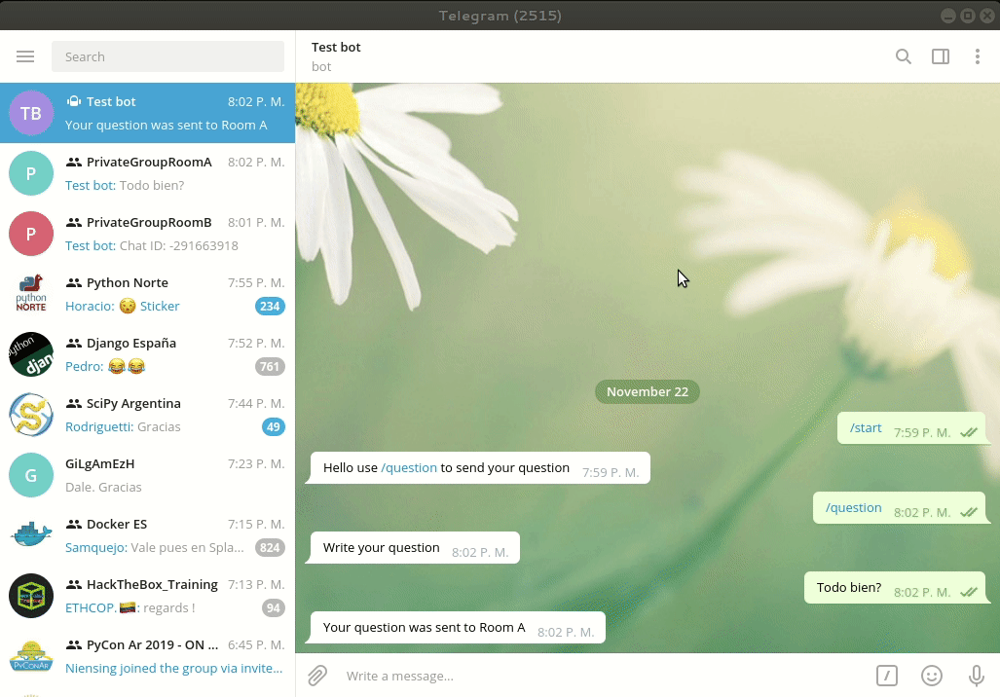
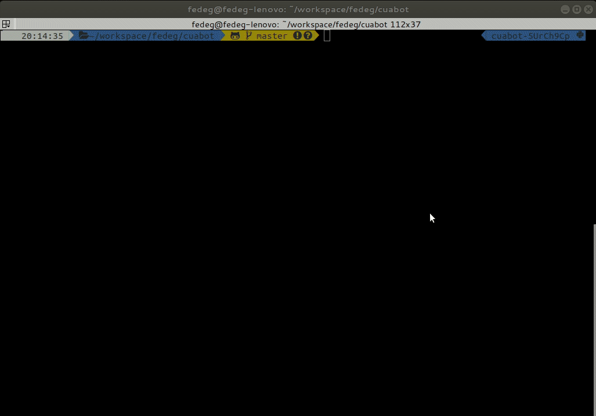

What is cuabot?
===============

It's a Telegram bot to handle questions from assistants to speakers in conferences.

.. image:: media/cuabot.png

The dynamics to use the bot is:

- any person may speak to the bot, anytime, it only has commands to send questions

- people in the conference, assisting to a talk, may send a question to the bot at any time (during the talk, or when the talk finishes); as the person uses a specific command, that question will be sent by the bot to a specific Telegram private group.

- there is one Telegram private group per conference room, supervised by the conference collaborators, specially by the person assigned to that conference room

- when each talk finishes, the room supervisor will have in the group those questions sent by the people during the talk (and more may come at that moment)

- the room supervisor can select from the received messages those that are *really questions* and read them to the speaker

This solve several common conference problems regarding Q&A:

- it's much easier to take courage to ask questions writing them than talking in a room full of people, specially if you are not a white middle-aged man, or the conference is not in your native language, for example

- the room supervisors select which questions to transmit, so they can avoid "non-questions" messages, or select the better questions if the time is short, etc

- the room supervisors would speak through the microphone, so the mic doesn't need to be carried away through all the room, and there's no risk of people not hearing the question or it not be recorded

How to use it?
==============

The idea is to start an instance of this bot during a conference. The steps to do this are:

- create a bot in Telegram

- configure credentials and other service particularities

- start cuabot and enjoy

Create the bot
--------------

Steps:

- Go to Telegram
- Start talking to BotFather
- /newbot
- insert username for the bot
- insert handler for the bot

Configure it all
----------------

Copy the ``example.yaml`` config file to something for you and change the parameters:

- ``bot_token``: the token from bot father obtained above

- ``welcome_message``: the message to show to the user when it starts interacting with the bot

- ``question_handler``: the command string (``/something``) to send questions to the bot

- ``question_handler_description``: the command description to be shown after you add it to the bot in the BotFather

- ``anonymous_question_handler``: the command string (``/something``) to send anonymous questions to the bot

- ``anonymous_question_handler_description``: the command description to be shown after you add it to the bot in the BotFather

- ``no_group_message``: the message to show when someone talks to the bot from a group

- ``select_room_message``: the message for the user to select the room

- ``enter_question_message``: the message for the user to enter the question

- ``sent_question_message``: the message for the user after the question was sent

- ``no_room_selected_message``: the message to show when you talk to the bot without using a command

- ``rooms``: the list of rooms handled by the bot, each one is a dict holding:

  - ``name``: the human friendly name for the room, to show to the user

  - ``chat_id``: the Telegram id for the room; one nice way to see it is to invite the bot to the specific room and call its ``/get_chat_id`` command

- ``schedule``: this is a list with the talks schedule, each one is a dict holding:

  - ``room``: the human friendly name for the room, to show to the user

  - ``talks``: this is a list of the talks for that room, each one is a dict holding (the talks must be in order):

    - ``start``: timestamp of the start of the talk

    - ``duration``: duration of the talk in minutes

    - ``name``: name of the talk

    - ``speaker``: name of the speaker

Get the command list to add to BotFather
-----------------------------------------

To get the command list to add to BotFather::

     python -m cuabot list-commands <config_file>
     Enter this commands in BotFather:
     question - Send question to room

Print the QR
------------

The simplest way for the public to be able to speak to the bot easily, is to generate a QR that when scanned points to the bot in Telegram.

To generate this is just run::

    python -m cuabot generate-qr <config_file> <qr_image_filepath>

Check the talks schedule
------------------------

A helper to check that the schedule is configured ok, use this link to help you with the timestamps `Epoch Converter <https://www.epochconverter.com>`_::

     python -m cuabot show-schedule <config_file>
     Room A:
     2019-12-04 09:00:00 [1575460800]: Talk 1 (Name of the Speaker) [3:30]
     2019-12-04 13:30:00 [1575477000]: Talk 2 (Name of the Speaker) [4:30]
     ----------------------
     Room B:
     2019-12-04 09:00:00 [1575460800]: Talk 3 (Name of the Speaker) [3:30]
     2019-12-04 13:30:00 [1575477000]: Talk 4 (Name of the Speaker) [4:30]

Start a cuabot instance
-----------------------

To start the bot run::

     python -m cuabot run <config_file>

Get the user or chat id where to send the messages
--------------------------------------------------

Run this command in the chat or directly to the bot::

     /get_chat_id
     Chat ID: -123456789

